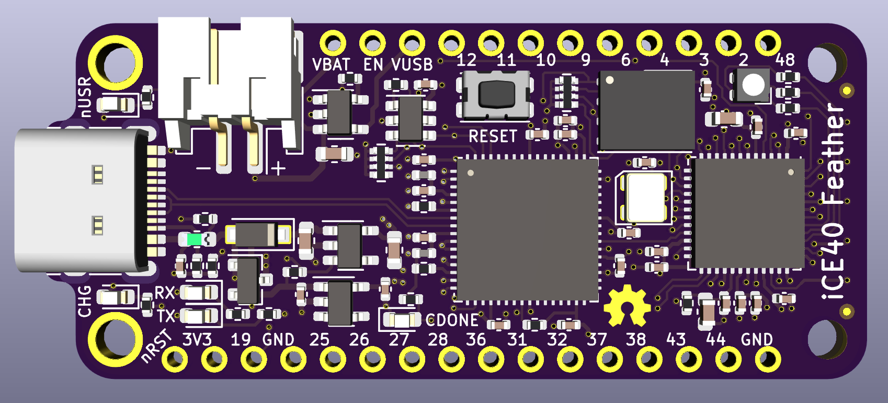

# iCE40-feather

iCE40 Feather is a Lattice iCE40UP5K FPGA in the [Adafruit Feather form factor](https://learn.adafruit.com/adafruit-feather/feather-specification).

## Features

- Lattice iCE40UP5K FPGA.
- 20 IO in the standard Feather pinout.
- 6 extra IO on AREF and extra pads on back of board.
- FT2232 enables both programming and communications over UART through a Type-C USB connector.
- QSPI flash.
- Onboard RX/TX, user, and RGB LEDs.

## Thanks

- Key parts of this board were based off the [iCEBreaker](https://github.com/icebreaker-fpga) project.
- [Tisham Dhar](https://twitter.com/whatnick/) was the driving force behing the 0.2 redesign.

### Revision History

- 0.1 used 0603 components, micro USB, and did not have the QSPI pins of the flash connected to the FPGA.
- 0.2 moved to 0402 components, USB Type-C, and broke all of the IO out whilst staying backwards compatible.
